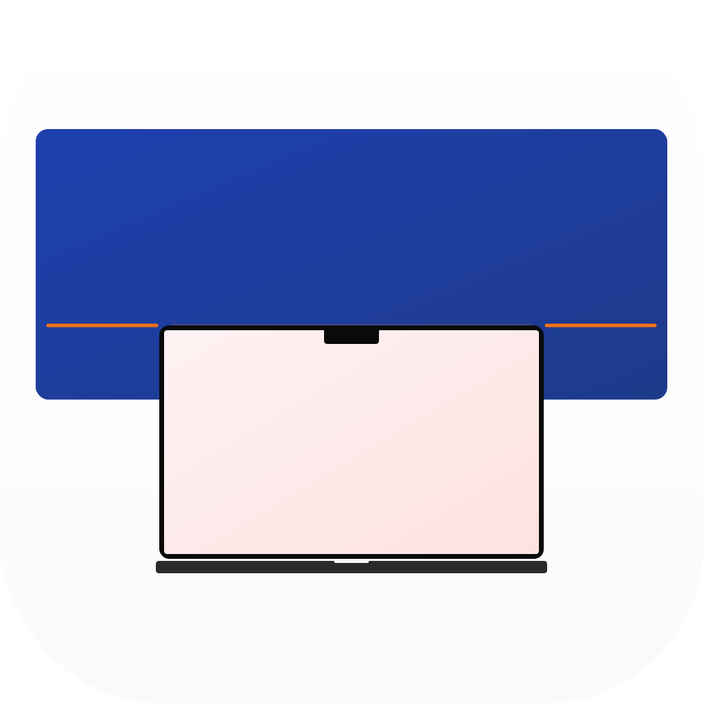
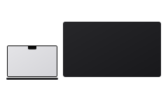
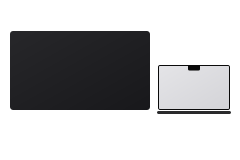
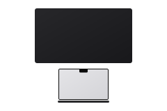

<p align="center">
  
</p>

<h1 align="center">Snap</h1>

<p align="center">
  <strong>Plug in a monitor. Pick a layout. Never open Display Settings again.</strong><br>
  A macOS menu bar utility that manages your display arrangement automatically.
</p>

<p align="center">
  
  
  
  
</p>

---

## The problem

Every time you plug in an external monitor, macOS picks an arrangement for you — and it's usually wrong. You open System Settings → Displays → drag rectangles around → close. Repeat tomorrow.

## The fix

Snap lives in your menu bar. When a display connects, a floating prompt appears:

1. **Choose your layout** — Extend right, left, or above. Or mirror.
2. **Optionally remember it** — next time that exact monitor connects, Snap applies your layout silently and shows a quick toast.

That's it. One interaction, then it's invisible.

<p align="center">
  
  
  
</p>

## Features

| | |
|---|---|
| 🔌 **Instant detection** | Recognises displays on plug-in and at app launch |
| 🖥️ **Extend or Mirror** | Visual preset diagrams — see what you're choosing before you apply |
| 🧠 **Per-display memory** | Remembers layouts by display UUID — different monitors, different configs |
| 📐 **Rich display info** | Name, screen size, native resolution (e.g. "DELL U2723QE 27″ 3840 × 2160") |
| 🔔 **Toast notifications** | Brief confirmation when a saved config is applied, with "Change" to re-prompt |
| 🚀 **Launch at login** | Set it and forget it |
| 🔄 **Auto-updates** | Built-in update checking via Sparkle |

## Install

> Releases coming soon. For now, build from source.

```bash
brew install xcodegen swiftformat swiftlint xcbeautify
git clone https://github.com/SteamedHamsAU/snap.git
cd snap
./Scripts/bootstrap.sh
```

Or manually:

```bash
xcodegen generate
xcodebuild build -scheme Snap -destination 'platform=macOS' CODE_SIGN_IDENTITY="-"
```

The built app lands in Xcode's DerivedData. Open `Snap.xcodeproj` in Xcode to set your Team ID for a signed build.

---

## Technical Details

### Architecture

AppKit + SwiftUI hybrid. AppKit owns the windowing (`NSPanel`, `NSStatusItem`, `NSHostingView`), SwiftUI owns the views.

```
Sources/Snap/
├── App/            Entry point, AppDelegate, Info.plist
├── Display/        Display monitoring, configuration, persistence
├── UI/             Window controllers (Prompt, Toast, MenuBar, Settings)
├── Views/          SwiftUI views hosted in AppKit windows
└── Extensions/     Type extensions
```

### Key decisions

- **Swift 6** with `SWIFT_STRICT_CONCURRENCY = complete` — no data races
- **Unsandboxed** — `CGDisplay` and `IOKit` APIs require it for display arrangement
- **Persistence** — per-display configs keyed by UUID in `~/Library/Application Support/Snap/displays.plist`
- **Direct distribution** — Sparkle 2 for auto-updates, no App Store
- **Universal binary** — Apple Silicon + Intel (`arm64 x86_64`)
- **No third-party UI** — SwiftUI + AppKit only
- **No Combine** — `AsyncStream` and structured concurrency throughout

### CI

Pull requests run on `macos-15` runners: SwiftFormat → SwiftLint → Build → Test.

## License

[MIT License](LICENSE) · Copyright © 2026 Steamed Hams Pty Ltd
